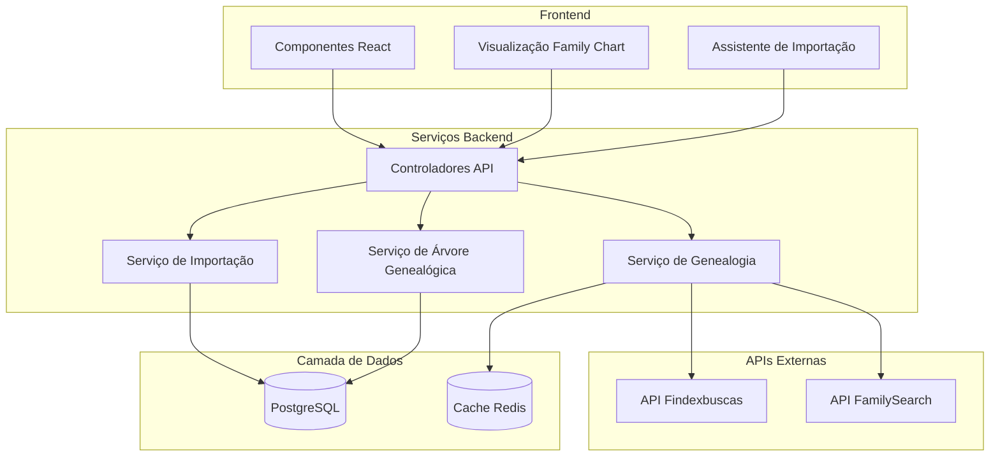

<h1 align="center">
  Genscan - Construtor de Árvore Genealógica
</h1>

<p align="center">
  
  
  
  <a href="https://github.com/gabrielmaialva33/genscan/commits/main">
    
  </a>
</p>

<p align="center">
    <a href="README.md">Inglês</a>
    ·
    <a href="README-pt.md">Português</a>
</p>

<p align="center">
  <a href="#bookmark-sobre">Sobre</a>&nbsp;&nbsp;&nbsp;|&nbsp;&nbsp;&nbsp;
  <a href="#sparkles-funcionalidades">Funcionalidades</a>&nbsp;&nbsp;&nbsp;|&nbsp;&nbsp;&nbsp;
  <a href="#computer-tecnologias">Tecnologias</a>&nbsp;&nbsp;&nbsp;|&nbsp;&nbsp;&nbsp;
  <a href="#package-instalação">Instalação</a>&nbsp;&nbsp;&nbsp;|&nbsp;&nbsp;&nbsp;
  <a href="#memo-licença">Licença</a>
</p>

## :bookmark: Sobre

O **Genscan** é um construtor de árvore genealógica moderno, projetado para ajudar as pessoas a descobrir e visualizar sua genealogia. Construído com poderosas capacidades de integração de dados, permite aos usuários importar dados familiares de APIs de genealogia brasileiras e criar árvores genealógicas interativas e bonitas.

O projeto combina a robustez do backend **AdonisJS v6** com um frontend dinâmico em **React 19**, apresentando visualizações interativas baseadas em D3.js através da biblioteca **family-chart**. Foi projetado para tornar a pesquisa genealógica acessível e envolvente para todos.

### 🏗️ Visão Geral da Arquitetura



## :sparkles: Funcionalidades

### Funcionalidades Principais
- **🌳 Árvores Genealógicas Interativas**: Visualizações bonitas e interativas com D3.js
- **🔍 Importação Inteligente de Dados**: Importe dados familiares usando CPF ou nome da mãe
- **👨‍👩‍👧‍👦 Gerenciamento de Relacionamentos**: Gerencie facilmente relacionamentos familiares complexos
- **📊 Múltiplas Árvores**: Crie e gerencie múltiplas árvores genealógicas
- **🔒 Controles de Privacidade**: Controle quem pode visualizar e editar suas árvores

### Integração de Dados
- **API de Genealogia Brasileira**: Integração com Findexbuscas para dados familiares brasileiros
- **Detecção Automática de Relacionamentos**: Algoritmos inteligentes para detectar e criar relacionamentos familiares
- **Prevenção de Duplicatas**: Detecção inteligente de duplicatas ao importar dados
- **Enriquecimento de Dados**: Enriqueça automaticamente perfis com dados públicos disponíveis

### Recursos de Visualização
- **Navegação Interativa**: Zoom, pan e explore grandes árvores genealógicas
- **Layouts Personalizados**: Diferentes estilos de visualização para sua árvore
- **Detalhes de Pessoas**: Clique em qualquer pessoa para ver informações detalhadas
- **Filtros por Geração**: Foque em gerações ou ramos específicos

### Funcionalidades Futuras
- **📸 Álbuns de Fotos**: Adicione fotos e documentos aos membros da família
- **📅 Visualização em Timeline**: Veja a história da sua família em uma linha do tempo
- **🌍 Integração com FamilySearch**: Conecte-se ao maior banco de dados genealógico do mundo
- **📄 Opções de Exportação**: Exporte sua árvore em vários formatos (PDF, GEDCOM)

## :computer: Tecnologias

### Backend
- **[AdonisJS v6](https://adonisjs.com/)**: Framework Node.js robusto
- **[PostgreSQL](https://www.postgresql.org/)**: Banco de dados relacional confiável
- **[Redis](https://redis.io/)**: Cache e gerenciamento de sessões
- **[Bull Queue](https://github.com/OptimalBits/bull)**: Processamento de jobs em background

### Frontend
- **[React 19](https://react.dev/)**: Biblioteca moderna de UI
- **[Inertia.js](https://inertiajs.com/)**: Experiência SPA perfeita
- **[family-chart](https://github.com/donatso/family-chart)**: Visualização de árvore genealógica baseada em D3.js
- **[Tailwind CSS](https://tailwindcss.com/)**: Framework CSS utility-first
- **[TypeScript](https://www.typescriptlang.org/)**: Tipagem segura em toda a stack

## :package: Instalação

### ✔️ Pré-requisitos

- **Node.js** (v18 ou superior)
- **pnpm** (ou npm/yarn)
- **PostgreSQL** (v14 ou superior)
- **Redis** (v6 ou superior)

### 🚀 Começando

1. **Clone o repositório:**

   ```sh
   git clone https://github.com/gabrielmaialva33/genscan.git
   cd genscan
   ```

2. **Instale as dependências:**

   ```sh
   pnpm install
   ```

3. **Configure as variáveis de ambiente:**

   ```sh
   cp .env.example .env
   ```

   Configure o seguinte no seu arquivo `.env`:
   - Credenciais do banco de dados
   - Conexão Redis
   - Token da API Findexbuscas

4. **Execute as migrações do banco de dados:**

   ```sh
   node ace migration:run
   ```

5. **Popule dados iniciais (opcional):**

   ```sh
   node ace db:seed
   ```

6. **Inicie o servidor de desenvolvimento:**
   ```sh
   pnpm dev
   ```
   
   Sua aplicação estará disponível em `http://localhost:3333`.

### 📜 Scripts Disponíveis

- `pnpm dev`: Inicia o servidor de desenvolvimento com HMR
- `pnpm build`: Compila para produção
- `pnpm start`: Executa o servidor de produção
- `pnpm test`: Executa testes unitários
- `pnpm test:e2e`: Executa testes end-to-end
- `pnpm lint`: Verifica o código com linter
- `pnpm format`: Formata o código com Prettier
- `pnpm typecheck`: Executa verificação de tipos TypeScript

## :rocket: Como Usar

1. **Crie uma Conta**: Cadastre-se com seu email
2. **Crie uma Árvore Genealógica**: Inicie sua primeira árvore familiar
3. **Importe Dados**: Use CPF ou nome da mãe para importar dados familiares
4. **Visualize**: Explore sua árvore genealógica com visualização interativa
5. **Compartilhe**: Convide membros da família para colaborar

## :memo: Licença

Este projeto está licenciado sob a **Licença MIT**. Veja o arquivo [LICENSE](LICENSE) para mais detalhes.

---

<p align="center">
  Feito com ❤️ para ajudar as pessoas a descobrir suas raízes
</p>