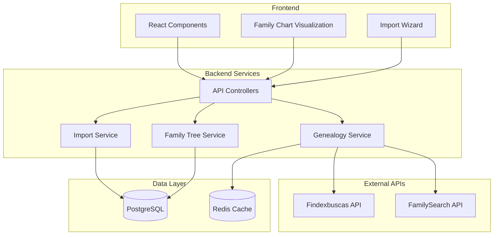

<h1 align="center">
  Genscan - Family Tree Builder
</h1>

<p align="center">
  
  
  
  <a href="https://github.com/gabrielmaialva33/genscan/commits/main">
    
  </a>
</p>

<p align="center">
    <a href="README.md">English</a>
    ·
    <a href="README-pt.md">Portuguese</a>
</p>

<p align="center">
  <a href="#bookmark-about">About</a>&nbsp;&nbsp;&nbsp;|&nbsp;&nbsp;&nbsp;
  <a href="#sparkles-features">Features</a>&nbsp;&nbsp;&nbsp;|&nbsp;&nbsp;&nbsp;
  <a href="#computer-technologies">Technologies</a>&nbsp;&nbsp;&nbsp;|&nbsp;&nbsp;&nbsp;
  <a href="#package-installation">Installation</a>&nbsp;&nbsp;&nbsp;|&nbsp;&nbsp;&nbsp;
  <a href="#memo-license">License</a>
</p>

## :bookmark: About

**Genscan** is a modern family tree builder designed to help people discover and visualize their genealogy. Built with powerful data integration capabilities, it allows users to import family data from Brazilian genealogy APIs and create interactive, beautiful family trees.

The project combines the robustness of **AdonisJS v6** backend with a dynamic **React 19** frontend, featuring interactive D3.js-based visualizations through the **family-chart** library. It's designed to make genealogy research accessible and engaging for everyone.

### 🏗️ Architecture Overview



## :sparkles: Features

### Core Features

- **🌳 Interactive Family Trees**: Beautiful, interactive visualizations powered by D3.js
- **🔍 Smart Data Import**: Import family data using Brazilian CPF or mother's name
- **👨‍👩‍👧‍👦 Relationship Management**: Easily manage complex family relationships
- **📊 Multiple Trees**: Create and manage multiple family trees
- **🔒 Privacy Controls**: Control who can view and edit your family trees

### Data Integration

- **Brazilian Genealogy API**: Integration with Findexbuscas for Brazilian family data
- **Automatic Relationship Detection**: Smart algorithms to detect and create family relationships
- **Duplicate Prevention**: Intelligent duplicate detection when importing data
- **Data Enrichment**: Automatically enrich profiles with available public data

### Visualization Features

- **Interactive Navigation**: Zoom, pan, and explore large family trees
- **Custom Layouts**: Different visualization styles for your family tree
- **Person Details**: Click on any person to view detailed information
- **Generation Filters**: Focus on specific generations or branches

### Upcoming Features

- **📸 Photo Albums**: Add photos and documents to family members
- **📅 Timeline View**: See your family history in a timeline
- **🌍 FamilySearch Integration**: Connect with the world's largest genealogy database
- **📄 Export Options**: Export your tree in various formats (PDF, GEDCOM)

## :computer: Technologies

### Backend

- **[AdonisJS v6](https://adonisjs.com/)**: Robust Node.js framework
- **[PostgreSQL](https://www.postgresql.org/)**: Reliable relational database
- **[Redis](https://redis.io/)**: Caching and session management
- **[Bull Queue](https://github.com/OptimalBits/bull)**: Background job processing

### Frontend

- **[React 19](https://react.dev/)**: Modern UI library
- **[Inertia.js](https://inertiajs.com/)**: Seamless SPA experience
- **[family-chart](https://github.com/donatso/family-chart)**: D3.js-based family tree visualization
- **[Tailwind CSS](https://tailwindcss.com/)**: Utility-first CSS framework
- **[TypeScript](https://www.typescriptlang.org/)**: Type safety across the stack

## :package: Installation

### ✔️ Prerequisites

- **Node.js** (v18 or higher)
- **pnpm** (or npm/yarn)
- **PostgreSQL** (v14 or higher)
- **Redis** (v6 or higher)

### 🚀 Getting Started

1. **Clone the repository:**

   ```sh
   git clone https://github.com/gabrielmaialva33/genscan.git
   cd genscan
   ```

2. **Install dependencies:**

   ```sh
   pnpm install
   ```

3. **Setup environment variables:**

   ```sh
   cp .env.example .env
   ```

   Configure the following in your `.env` file:
   - Database credentials
   - Redis connection
   - Findexbuscas API token

4. **Run database migrations:**

   ```sh
   node ace migration:run
   ```

5. **Seed initial data (optional):**

   ```sh
   node ace db:seed
   ```

6. **Start the development server:**

   ```sh
   pnpm dev
   ```

   Your application will be available at `http://localhost:3333`.

### 📜 Available Scripts

- `pnpm dev`: Start development server with HMR
- `pnpm build`: Build for production
- `pnpm start`: Run production server
- `pnpm test`: Run unit tests
- `pnpm test:e2e`: Run end-to-end tests
- `pnpm lint`: Lint the codebase
- `pnpm format`: Format code with Prettier
- `pnpm typecheck`: Run TypeScript type checking

## :rocket: Usage

1. **Create an Account**: Sign up with your email
2. **Create a Family Tree**: Start your first family tree
3. **Import Data**: Use CPF or mother's name to import family data
4. **Visualize**: Explore your family tree with interactive visualization
5. **Share**: Invite family members to collaborate

## :memo: License

This project is licensed under the **MIT License**. See the [LICENSE](LICENSE) file for details.

---

<p align="center">
  Built with ❤️ to help people discover their roots
</p>
